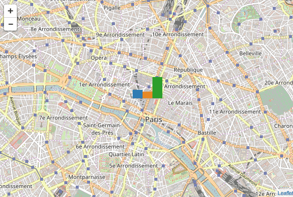

# Leaflet.minichart

Leaflet.minichart is a leaflet plugin for adding to a leaflet map small animated bar charts, pie charts or polar area charts.

It can be used to visualize multiple variables associated to geographical coordinates and to look at the evolution of these variables.

Here are screenshots of some maps that use this plugin.


This plugin is also available as an [R package](https://github.com/rte-antares-rpackage/leaflet.minicharts).

## Usage

You need to include the `leaflet` CSS and javascript files and then the `leaflet.minichart` javascript file in the head section of your document:

``` xml
<link rel="stylesheet" href="https://unpkg.com/leaflet@1.0.2/dist/leaflet.css" media="screen" title="leaflet">
<script src="https://unpkg.com/leaflet@1.0.2/dist/leaflet.js" charset="utf-8"></script>
<script src="https://unpkg.com/leaflet.minichart/dist/leaflet.minichart.min.js" charset="utf-8"></script>
```

Once these files included, you can create charts with function `L.minichart()`. All parameters are described [here](https://rte-antares-rpackage.github.io/leaflet.minichart/-_L.Minichart_.html).

## Example

Here is a sample code that initializes a map and adds to it a barchart that represents three random values. Then the code updates the value every two seconds and redraws the chart.

``` javascript
var center = [48.861415, 2.349326];

var mymap = L.map('map').setView(coord, 13);
L.tileLayer('http://{s}.tile.openstreetmap.org/{z}/{x}/{y}.png').addTo(mymap);

// Let us generate fake data
function fakeData() {
  return [Math.random(), Math.random(), Math.random()];
}

// Create a barchart
var myBarChart = L.minichart(center, {data: fakeData()});
mymap.addLayer(myBarChart);

// Update data every 2 seconds
setInterval(function() {
  myBarChart.setOptions({data: fakeData()})
}, 2000);
```



You can find more complete examples here:
* [International comparison of PISA scores](https://rte-antares-rpackage.github.io/leaflet.minichart/tutorial-PISA%20scores.html)
